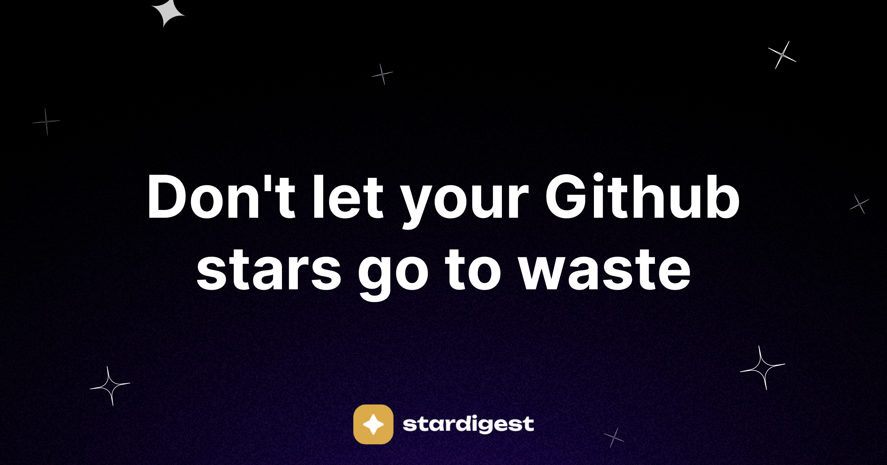

# StarDigest

StarDigest is a newsletter that sends you a daily or weekly roundup with your starred Github repo's (you know, so you don't forget about they exist). You don't have to lift a finger, just star and we'll do the rest.



## Developing

Once you've created a project and installed dependencies with `pnpm install` start a development server:

```bash
pnpm run dev

# or start the server and open the app in a new browser tab
pnpm run dev -- --open
```

## Building

To create a production version of your app:

```bash
pnpm run build
```

## Acknowledgements

- [lil shapes](https://www.figma.com/community/file/1222735604132462255/lil-shapes-%E2%80%A2-2023.4) - For the logo icon

You can preview the production build with `pnpm run preview`.
